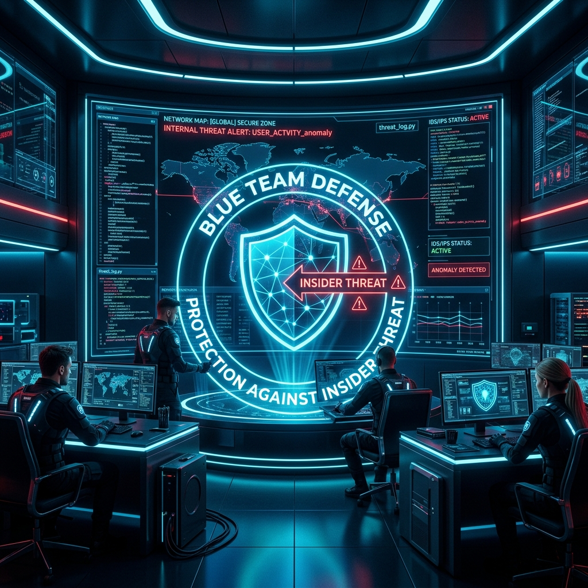
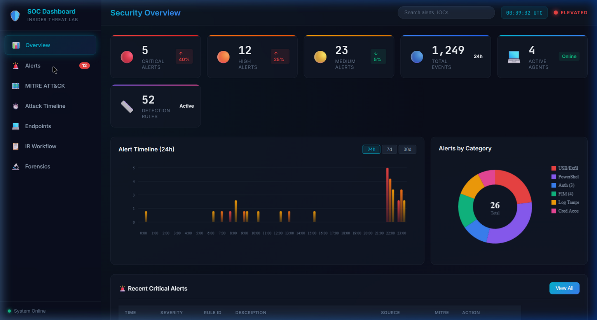
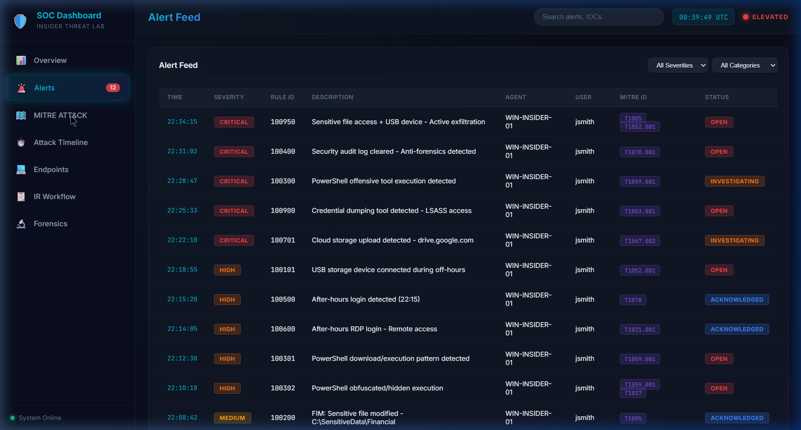
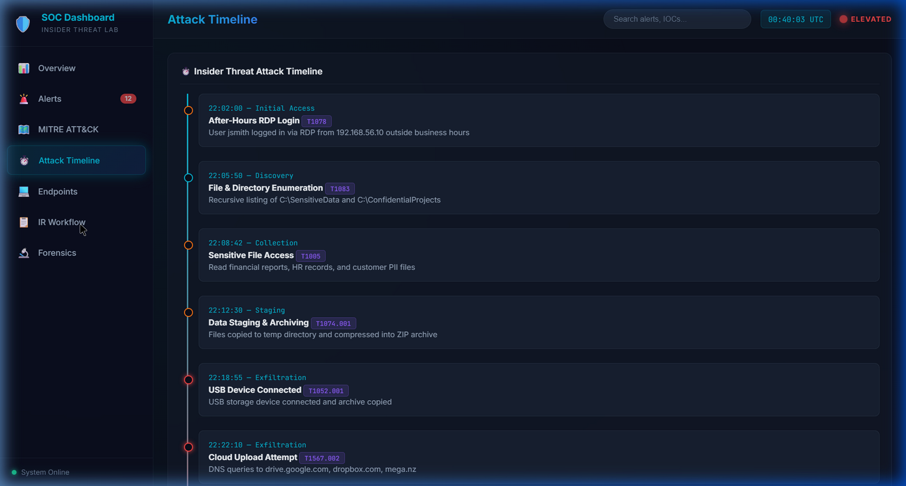

# 🛡️ Insider Threat Detection & Incident Response Lab



[](LICENSE)
[]()
[]()
[]()
[](https://github.com/geevarghesekthomas84-sys/insider-threat-detection-lab)

> **A comprehensive Blue Team project simulating real-world insider threat scenarios with full detection, investigation, containment, and response capabilities using enterprise-grade SIEM/XDR tooling.**


---

## 📋 Table of Contents

- [Overview](#overview)
- [Architecture](#architecture)
- [Lab Environment](#lab-environment)
- [Quick Start](#quick-start)
- [Attack Scenarios](#attack-scenarios)
- [Detection Capabilities](#detection-capabilities)
- [Incident Response Workflow](#incident-response-workflow)
- [MITRE ATT&CK Coverage](#mitre-attck-coverage)
- [Project Structure](#project-structure)
- [Deliverables](#deliverables)
- [Screenshots](#screenshots)
- [Contributing](#contributing)

---

## 🎯 Overview

This project implements a **full-stack Blue Team Security Operations Center (SOC)** lab focused on **insider threat detection and response**. It simulates a realistic scenario where a privileged employee abuses their access to exfiltrate sensitive company data, and demonstrates how a Blue Team detects, investigates, contains, and remediates the breach.

### Key Capabilities

| Category | Implementation |
|----------|---------------|
| **SIEM/XDR** | Wazuh Manager + Agents |
| **Log Analytics** | Splunk Enterprise + Forwarders |
| **Visualization** | ELK Stack (Elasticsearch + Logstash + Kibana) |
| **Endpoint Telemetry** | Sysmon + Windows Event Logs |
| **File Integrity** | Wazuh FIM + Custom Rules |
| **Threat Detection** | 50+ Custom Detection Rules |
| **Threat Intelligence** | SIGMA Rules + MITRE ATT&CK Mapping |
| **Incident Response** | Automated Playbooks + Manual Procedures |
| **Forensics** | Evidence Collection + Timeline Analysis |

---

## 🏗️ Architecture

```
┌──────────────────────────────────────────────────────────────────┐
│                    BLUE TEAM SOC ARCHITECTURE                     │
├──────────────────────────────────────────────────────────────────┤
│                                                                   │
│  ┌─────────────┐     ┌─────────────┐     ┌─────────────────────┐ │
│  │  Kali Linux  │     │ Windows 10  │     │  Active Directory   │ │
│  │  (Attacker)  │────▶│ (Insider)   │────▶│  Domain Controller  │ │
│  │ 192.168.56.10│     │192.168.56.20│     │  192.168.56.30      │ │
│  └─────────────┘     └──────┬──────┘     └──────────┬──────────┘ │
│                              │                       │            │
│                    ┌─────────▼───────────────────────▼──────┐    │
│                    │         Sysmon + Wazuh Agent           │    │
│                    │         Splunk Universal Forwarder      │    │
│                    └─────────────────┬──────────────────────┘    │
│                                      │                           │
│            ┌─────────────────────────▼──────────────────────┐   │
│            │           Ubuntu Server (192.168.56.40)         │   │
│            │  ┌──────────┐  ┌────────┐  ┌────────────────┐  │   │
│            │  │  Wazuh   │  │Splunk  │  │  ELK Stack     │  │   │
│            │  │ Manager  │  │Enterprise│ │ ES+LS+Kibana  │  │   │
│            │  │ :55000   │  │ :8000  │  │ :5601/:9200   │  │   │
│            │  └──────────┘  └────────┘  └────────────────┘  │   │
│            └────────────────────────────────────────────────┘   │
│                                                                   │
│  ┌──────────────────────────────────────────────────────────────┐ │
│  │                    SOC Dashboard (Web UI)                     │ │
│  │          Real-time Alerts │ MITRE Mapping │ IR Workflow       │ │
│  └──────────────────────────────────────────────────────────────┘ │
└──────────────────────────────────────────────────────────────────┘
```

---

## 🖥️ Lab Environment

### Required Virtual Machines

| VM | OS | Role | IP Address | RAM | Disk |
|----|-----|------|------------|-----|------|
| **Attacker** | Kali Linux 2024.x | Attack Simulation | 192.168.56.10 | 2 GB | 40 GB |
| **Insider** | Windows 10/11 Pro | Employee Workstation | 192.168.56.20 | 4 GB | 60 GB |
| **DC** | Windows Server 2019 | Active Directory DC | 192.168.56.30 | 4 GB | 60 GB |
| **SOC Server** | Ubuntu 22.04 LTS | Wazuh + ELK + Splunk | 192.168.56.40 | 8 GB | 100 GB |

### Network Configuration

- **Network Type**: Host-Only Network (VirtualBox) / Custom NAT (VMware)
- **Subnet**: 192.168.56.0/24
- **Gateway**: 192.168.56.1
- **DNS**: 192.168.56.30 (AD DC)

---

## 🚀 Quick Start

### 1. Clone the Repository

```bash
git clone https://github.com/yourusername/insider-threat-lab.git
cd insider-threat-lab
```

### 2. Set Up VMs

Follow the detailed guide: [Lab Setup Guide](docs/01_Lab_Setup_Guide.md)

### 3. Install Security Stack

```bash
# On Ubuntu SOC Server
chmod +x scripts/setup/*.sh
sudo ./scripts/setup/install_wazuh_manager.sh
sudo ./scripts/setup/install_elk_stack.sh
sudo ./scripts/setup/install_splunk.sh
```

### 4. Deploy Agents (Windows)

```powershell
# On Windows Insider Machine (Run as Administrator)
.\scripts\setup\deploy_sysmon.ps1
.\scripts\setup\deploy_wazuh_agent.ps1
```

### 5. Run Attack Simulation

```powershell
# On Windows Insider Machine
.\scripts\attack-simulation\run_all_attacks.ps1
```

### 6. Investigate & Respond

Open SOC Dashboard → Detect → Investigate → Contain → Remediate

---

## 💣 Attack Scenarios

| # | Attack | Technique | MITRE ID |
|---|--------|-----------|----------|
| 1 | Sensitive File Access | Collection - Data from Local System | T1005 |
| 2 | USB Data Exfiltration | Exfiltration - Exfiltration Over Physical Medium | T1052.001 |
| 3 | Cloud Upload Simulation | Exfiltration - Exfiltration Over Web Service | T1567 |
| 4 | After-Hours Login | Initial Access - Valid Accounts | T1078 |
| 5 | Suspicious PowerShell | Execution - PowerShell | T1059.001 |
| 6 | Event Log Clearing | Defense Evasion - Indicator Removal | T1070.001 |
| 7 | Log Tampering | Defense Evasion - Indicator Removal on Host | T1070 |
| 8 | Credential Harvesting | Credential Access - OS Credential Dumping | T1003 |
| 9 | Lateral Movement | Lateral Movement - Remote Services | T1021 |
| 10 | Scheduled Task Persistence | Persistence - Scheduled Task/Job | T1053.005 |

---

## 🔍 Detection Capabilities

### Wazuh Custom Rules (50+ Rules)
- File Integrity Monitoring (FIM) alerts
- USB device connection/disconnection
- Suspicious PowerShell execution
- After-hours authentication events
- Privilege escalation attempts
- Log clearing and tampering
- Unauthorized network connections
- Registry modification detection

### Splunk Correlation Searches
- Multi-stage attack detection
- Behavioral anomaly analysis
- Data exfiltration volume tracking
- Login pattern analysis
- VPN anomaly detection

### SIGMA Rules
- Vendor-agnostic detection rules
- Compatible with Splunk, ELK, Wazuh
- Community-maintained rule format

---

## 🚨 Incident Response Workflow

```
┌─────────┐    ┌───────────┐    ┌────────────┐    ┌──────────┐    ┌───────────┐    ┌────────────┐
│DETECTION │───▶│TRIAGE &   │───▶│INVESTIGATION│───▶│CONTAINMENT│───▶│ERADICATION│───▶│RECOVERY &  │
│          │    │ANALYSIS   │    │            │    │          │    │           │    │LESSONS     │
│• Alerts  │    │• Severity │    │• Timeline  │    │• Isolate │    │• Remove   │    │LEARNED     │
│• FIM     │    │• Scope    │    │• Evidence  │    │• Disable │    │  Access   │    │• Report    │
│• Rules   │    │• Impact   │    │• IOCs      │    │• Block   │    │• Patch    │    │• Improve   │
└─────────┘    └───────────┘    └────────────┘    └──────────┘    └───────────┘    └────────────┘
```

Detailed workflow: [Incident Response Playbook](docs/09_Incident_Response.md)

---

## 🗺️ MITRE ATT&CK Coverage

| Tactic | Techniques Covered |
|--------|--------------------|
| **Initial Access** | T1078 (Valid Accounts) |
| **Execution** | T1059.001 (PowerShell), T1059.003 (Windows Command Shell) |
| **Persistence** | T1053.005 (Scheduled Task), T1547.001 (Registry Run Keys) |
| **Privilege Escalation** | T1078 (Valid Accounts), T1548.002 (UAC Bypass) |
| **Defense Evasion** | T1070.001 (Clear Windows Event Logs), T1070 (Indicator Removal) |
| **Credential Access** | T1003 (OS Credential Dumping), T1552.001 (Credentials In Files) |
| **Discovery** | T1083 (File and Directory Discovery), T1082 (System Info Discovery) |
| **Lateral Movement** | T1021.001 (Remote Desktop), T1021.002 (SMB/Windows Admin Shares) |
| **Collection** | T1005 (Data from Local System), T1074.001 (Local Data Staging) |
| **Exfiltration** | T1052.001 (Exfiltration over USB), T1567 (Exfiltration over Web Service) |

Full mapping: [MITRE ATT&CK Mapping](docs/11_MITRE_ATTACK_Mapping.md)

---

## 📁 Project Structure

```
insider-threat-lab/
├── README.md                          # This file
├── LICENSE                            # MIT License
├── docs/                              # Documentation
│   ├── 01_Lab_Setup_Guide.md
│   ├── 02_Wazuh_Installation.md
│   ├── 03_Splunk_Setup.md
│   ├── 04_ELK_Setup.md
│   ├── 05_Sysmon_Deployment.md
│   ├── 06_FIM_Configuration.md
│   ├── 07_Detection_Rules.md
│   ├── 08_Attack_Simulation.md
│   ├── 09_Incident_Response.md
│   ├── 10_Forensics_Report.md
│   ├── 11_MITRE_ATTACK_Mapping.md
│   ├── 12_Remediation_Report.md
│   └── 13_Final_Report.md
├── configs/                           # Configuration files
│   ├── wazuh/
│   ├── splunk/
│   ├── elk/
│   ├── sysmon/
│   └── active-directory/
├── scripts/                           # Automation scripts
│   ├── setup/
│   ├── attack-simulation/
│   ├── detection/
│   ├── response/
│   └── forensics/
├── rules/                             # Detection rules
│   ├── wazuh/
│   ├── splunk/
│   └── sigma/
├── dashboards/                        # Dashboard configs + Web UI
│   ├── splunk/
│   ├── kibana/
│   └── web/
├── evidence/                          # Forensic evidence
├── reports/                           # Report templates
└── presentation/                      # Presentation files
```

---

## 📦 Deliverables

- [x] Complete lab environment setup with 4 VMs
- [x] Wazuh Manager with 50+ custom detection rules
- [x] Splunk Enterprise with correlation searches
- [x] ELK Stack with Kibana dashboards
- [x] Sysmon deployed with comprehensive configuration
- [x] 10 realistic attack simulation scripts
- [x] File Integrity Monitoring (FIM) configuration
- [x] USB activity monitoring
- [x] PowerShell activity monitoring
- [x] Login anomaly detection
- [x] VPN anomaly detection
- [x] SOC Web Dashboard
- [x] Incident Response Playbook
- [x] Forensic Evidence Collection
- [x] IOC Extraction Tools
- [x] MITRE ATT&CK Mapping
- [x] Remediation Report
- [x] Final PDF Report Template
- [x] Presentation Outline

---

## 📸 Screenshots

*Screenshots are generated from the live SOC dashboard and detection tools during attack simulation.*

| Dashboard | Preview |
|-----------|-------------|
| **SOC Overview** |  |
| **Alert Feed** |  |
| **Attack Timeline** |  |


---

## 🤝 Contributing

Contributions are welcome! Please read the [Contributing Guide](CONTRIBUTING.md) for details.

---

## 📝 License

This project is licensed under the MIT License - see the [LICENSE](LICENSE) file for details.

---

## ⚠️ Disclaimer

This project is designed for **educational and authorized security testing purposes only**. All attack simulations must be performed in isolated lab environments. Unauthorized use of these tools against systems you do not own or have explicit permission to test is illegal.

---

**Built with 🛡️ by Blue Team Security Researchers**
